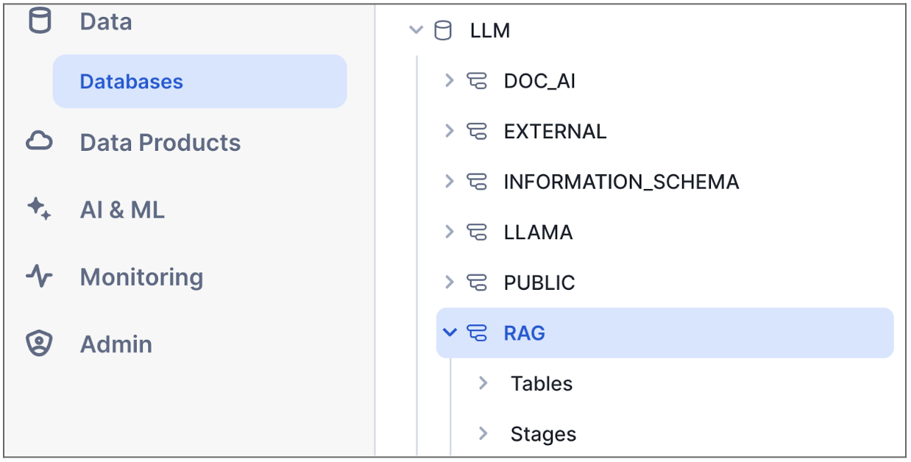
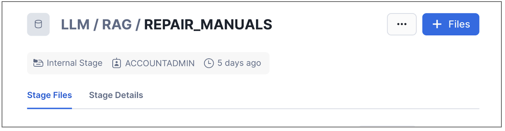
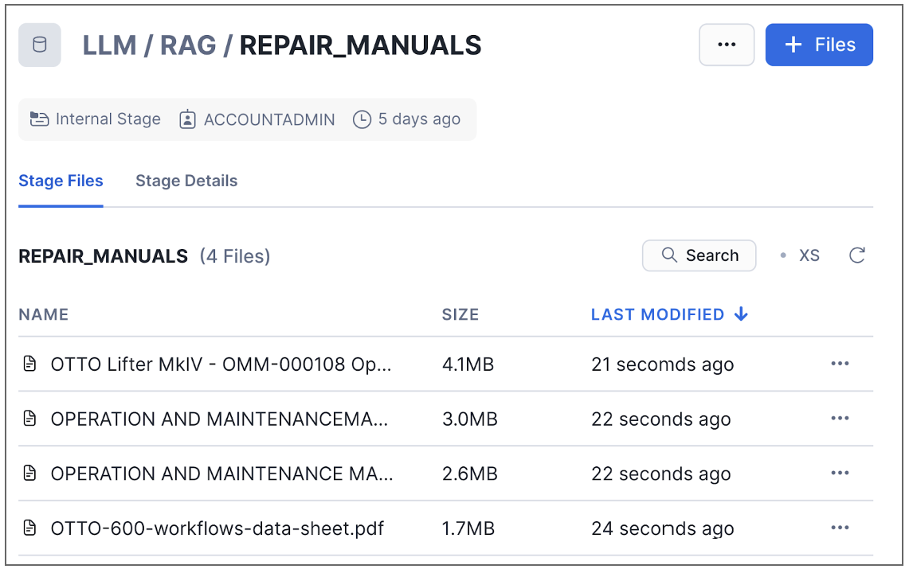
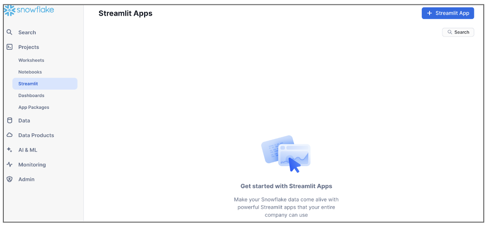
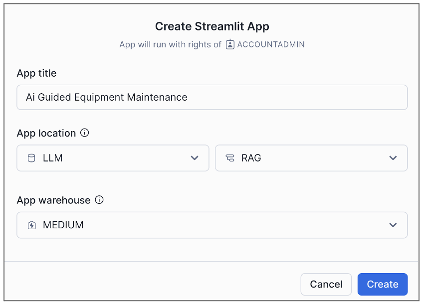
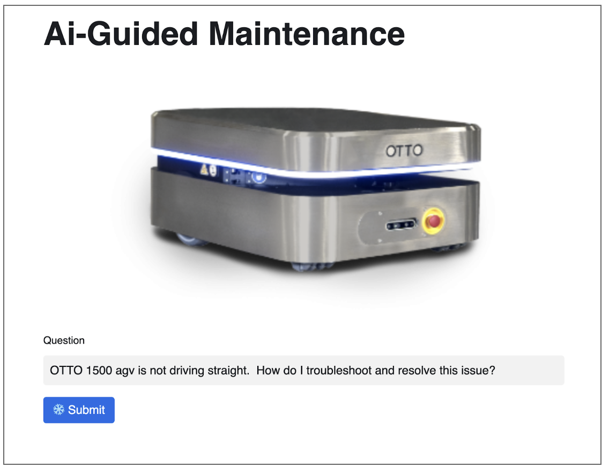

## **1. Environment Setup**

Create your trial account via below link.  
[https://signup.snowflake.com/](https://signup.snowflake.com/)

**Edition:** Enterprise  
**Region:** Azure East US 2 (Virginia)


```
USE ROLE ACCOUNTADMIN;

CREATE OR REPLACE WAREHOUSE Medium WAREHOUSE_SIZE='Medium' AUTO_SUSPEND = 60;
CREATE OR REPLACE WAREHOUSE notebook_wh WAREHOUSE_SIZE='xsmall' AUTO_SUSPEND =60;
CREATE OR REPLACE DATABASE LLM;
CREATE OR REPLACE SCHEMA RAG;

USE LLM.RAG;

CREATE or REPLACE STAGE REPAIR_MANUALS  
DIRECTORY = (ENABLE = true)
ENCRYPTION = (TYPE = 'SNOWFLAKE_SSE');

CREATE ROLE cortex_user_role;
GRANT DATABASE ROLE SNOWFLAKE.CORTEX_USER TO ROLE cortex_user_role;

SET curr_usr = (SELECT CURRENT_USER());

GRANT ROLE cortex_user_role TO USER identifier($curr_usr);
```

### **Upload Repair Manuals to Snowflake**

Download the four repair manuals needed from github.

[https://github.com/Snowflake-Labs/sfguide-build-rag-based-equipment-maintenance-app-using-snowflake-cortex/tree/main/Ai%20Maintenance/Repair%20Manuals](https://github.com/Snowflake-Labs/sfguide-build-rag-based-equipment-maintenance-app-using-snowflake-cortex/tree/main/Ai%20Maintenance/Repair%20Manuals)

1. From your snowsight UI, click \*\*Data \-\> Databases. Then click LLM and then RAG.


 

2. Click on Stages and then Repair Manuals. You will see a screen to add files to your stage  

     
3. Click the blue \+ Files button in the top right and browse to where you downloaded the repair manuals. Once uploaded it should look like this.



##
## **2. Create Cortex Service for Repair Manuals**
In this step, we will parse the uploaded manuals and extract text in order to index with Cortex Search Engine.

Set the context and check the files. You should see four files as result of list command.

```
--Set Context
USE ROLE ACCOUNTADMIN;
USE DATABASE LLM;
USE SCHEMA RAG;
USE WAREHOUSE MEDIUM;

-------------------------------------------------------------
------- Check the files that you uploaded to stage ---------
list @repair_manuals;
```

Now it is time for extracting the text from PDF files into a table. Snowflake has ***PARSE\_DOCUMENT*** function to parse the documents.

```
CREATE OR REPLACE TABLE repair_manuals AS
SELECT RELATIVE_PATH as file_name, SNOWFLAKE.CORTEX.PARSE_DOCUMENT(
   @llm.rag.repair_manuals, -- stage
   RELATIVE_PATH, -- relative path
   {'mode': 'ocr'}
):content as contents FROM DIRECTORY(@llm.rag.repair_manuals);

--Validate
SELECT * FROM repair_manuals;
```

Next step is to split text into smaller chunks so they can be turned into meaningful vectors.  
We will use ***SPLIT\_TEXT\_RECURSIVE\_CHARACTER*** function to split texts into smaller chunks.

```
-- split text into chunks
CREATE OR REPLACE TABLE repair_manuals_chunked AS 
SELECT
   file_name,
   c.value::varchar chunk_text
FROM
   repair_manuals,
   LATERAL FLATTEN( input => SNOWFLAKE.CORTEX.SPLIT_TEXT_RECURSIVE_CHARACTER (
      contents,
      'markdown', -- keep blocks together
      3000,-- number of characters in each chunk
      1000 -- overlap of chunks.
   )) c;

-- Validate results
SELECT * FROM repair_manuals_chunked;
```

Create Cortex Search service from the ***repair\_manuals\_chunked*** table.

```
--Create Cortex Search Service for Automated RAG 
CREATE or REPLACE CORTEX SEARCH SERVICE REPAIR_MANUALS_SEARCH 
ON CHUNK_TEXT
ATTRIBUTES file_name
WAREHOUSE = medium
TARGET_LAG = '365 day'
AS ( SELECT CHUNK_TEXT, file_name 
FROM repair_manuals_chunked );

SHOW CORTEX SEARCH SERVICES;
```

Set a search prompt to find the most relevant chunks from the search service.

```
--------------------------------------------------------
-- Search information from Cortex Search Service
-------------------------------------------------------- 
SET prompt = 'OTTO 1500 agv is not driving straight. How do I troubleshoot and resolve this issue?';

SET search_prompt = concat('{"query": "',$prompt,'","columns":["CHUNK_TEXT"],"limit":5}');

SELECT PARSE_JSON(
  SNOWFLAKE.CORTEX.SEARCH_PREVIEW(
      'REPAIR_MANUALS_SEARCH', --search service name
      $search_prompt
  )
)['results'] as result;

```

Let’s create a function to search the chunks and process results with an LLM to create contextualized responses. This function will find the most relevant chunk and will also convert it into a meaningful response.  

Please note that, we are using ***mixtral-8x7b*** as LLM model in below code. You can use different models like Llama or Gemini. All you have to do is to change the model name in the SQL.

```
CREATE OR REPLACE FUNCTION REPAIR_MANUALS_LLM(prompt string, search_prompt string)
RETURNS TABLE (response string)
AS
    $$
    WITH best_match_chunk AS (
          SELECT PARSE_JSON(
            SNOWFLAKE.CORTEX.SEARCH_PREVIEW('REPAIR_MANUALS_SEARCH',search_prompt)
        )['results'] as result_chunks
    )
    SELECT 
        SNOWFLAKE.cortex.COMPLETE('mixtral-8x7b', 
            CONCAT('Answer this question: ', PROMPT, '\n\nUsing this repair manual text: ', result_chunks)
        ) AS response
    FROM
        best_match_chunk
    $$;

select * from table(REPAIR_MANUALS_LLM($prompt, $search_prompt));
```

## 
## **3. Create Cortex Service for Historical Repair Logs**

This time instead of using PDF files, we will generate a historical log table and create a service on this table.

```
USE LLM.RAG;

----------------------------------------------------------------------
-- Create a table to represent equipment repair logs
----------------------------------------------------------------------  
CREATE OR REPLACE TABLE repair_logs (
    date_reported datetime, 
    equipment_model string,
    equipment_id string,
    problem_reported string,
    resolution_notes string
);
```

Let’s insert some data. 

```
----------------------------------------------------------------------
-- Load (simulated) repair logs.
----------------------------------------------------------------------  
INSERT INTO repair_logs (date_reported, equipment_model, equipment_id, problem_reported, resolution_notes) VALUES
('2023-03-23 08:42:48', 'Otto Forklift', 'AGV-010', 'Vision System Calibration Error', 'Recalibrated the vision system and replaced damaged image sensors. Tested object recognition accuracy.'),
('2023-09-30 04:42:47', 'Otto 100', 'AGV-011', 'Wireless Receiver Malfunction', 'Replaced faulty wireless receiver and updated communication protocols. Ensured robust signal reception.'),
('2023-09-27 05:01:16', 'Otto Forklift', 'AGV-006', 'Inadequate Lifting Force', 'Adjusted the hydraulic pressure settings and replaced weak hydraulic pistons. Tested lifting capacity with maximum load.'),
('2023-02-16 09:42:31', 'Otto 1500', 'AGV-001', 'Hydraulic System Overpressure', 'Adjusted hydraulic system and replaced faulty pressure valves. Ensured safe and stable operation.'),
('2023-10-29 23:44:57', 'Otto 600', 'AGV-003', 'Erratic Forklift Movement', 'Repaired damaged forklift steering components and recalibrated steering controls. Ensured smooth and accurate movement.'),('2023-11-21 18:35:09', 'Otto 600', 'AGV-002', 'Motor Torque Fluctuations', 'Replaced worn motor brushes and serviced motor components. Calibrated motor for consistent torque output.'),
('2023-07-04 14:22:33', 'Otto Forklift', 'AGV-005', 'Control Software Hangs', 'Diagnosed software hanging issue, optimized system resources, and applied software updates. Conducted stress tests for reliability.'),
('2023-12-13 21:16:49', 'Otto 1500', 'AGV-004', 'Path Deviation in Navigation', 'Updated navigation algorithms and recalibrated wheel encoders. Performed path accuracy tests in different layouts.'),
('2023-08-10 10:55:43', 'Otto 100', 'AGV-012', 'Steering Response Delay', 'Diagnosed and fixed the delay in steering response. Calibrated the steering system for immediate and accurate response.'),
('2023-05-15 16:11:28', 'Otto Forklift', 'AGV-009', 'Unresponsive Touch Panel', 'Replaced the touch panel and updated the interface software. Tested for user interaction and responsiveness.'),
('2023-08-31 02:54:20', 'Otto 100', 'AGV-003', 'Charging System Inefficiency', 'Upgraded the charging system components and optimized charging algorithms for faster and more efficient charging.'),
('2023-10-05 20:24:19', 'Otto Forklift', 'AGV-008', 'Payload Sensor Inaccuracy', 'Calibrated payload sensors and replaced defective units. Ensured accurate load measurement and handling.'),
('2023-02-19 22:29:24', 'Otto 1500', 'AGV-009', 'Cooling Fan Malfunction', 'Replaced malfunctioning cooling fans and cleaned air vents. Tested under load to ensure effective heat dissipation.'),
('2023-05-29 15:09:15', 'Otto 100', 'AGV-011', 'Drive Motor Overheating', 'Serviced drive motors and replaced worn components. Improved motor cooling and monitored temperature during operation.'),
('2023-04-30 01:03:03', 'Otto 600', 'AGV-002', 'Laser Scanner Inaccuracy', 'Calibrated laser scanners and updated scanning software. Ensured precise environmental mapping and obstacle detection.'),
('2023-03-14 13:15:52', 'Otto Forklift', 'AGV-006', 'Conveyor Belt Misalignment', 'Realigned the conveyor belt and adjusted tension settings. Conducted operational tests for smooth and consistent movement.'),
('2023-11-14 08:11:58', 'Otto 1500', 'AGV-012', 'Forklift Sensor Misalignment', 'Realigned forklift sensors and calibrated for precise object positioning and handling.'),
('2023-12-24 22:35:13', 'Otto 600', 'AGV-008', 'Erratic Forklift Movement', 'Repaired damaged forklift steering components and recalibrated steering controls. Ensured smooth and accurate movement.'),
('2023-09-20 08:08:16', 'Otto 100', 'AGV-007', 'Hydraulic System Overpressure', 'Adjusted hydraulic system pressure settings and replaced faulty pressure valves. Ensured safe and stable operation.'),
('2023-10-20 00:37:29', 'Otto 600', 'AGV-003', 'Forklift Sensor Misalignment', 'Performed alignment on forklift sensors and calibrated for precise object positioning and handling.'),('2023-08-20 12:49:44', 'Otto 1500', 'AGV-008', 'Control Software Hangs', 'Diagnosed software hanging issue, optimized system resources, and applied software updates. Conducted stress tests for reliability.'),
('2023-07-08 03:37:26', 'Otto 1500', 'AGV-002', 'Wireless Receiver Malfunction', 'Replaced faulty wireless receiver and updated communication protocols. Ensured robust signal reception.'),
('2023-10-12 09:05:07', 'Otto 1500', 'AGV-001', 'Laser Scanner Inaccuracy', 'Calibrated laser scanners and updated scanning software. Ensured precise environmental mapping and obstacle detection.'),
('2023-03-12 19:28:34', 'Otto 1500', 'AGV-008', 'Hydraulic System Overpressure', 'Adjusted hydraulic system pressure settings and replaced faulty pressure valves. Ensured safe and stable operation.'),
('2023-01-19 23:10:03', 'Otto 600', 'AGV-006', 'Inconsistent Conveyor Speed', 'Repaired gearbox in conveyor attachment and adjusted speed control settings. Verified consistent conveyor operation.'),
('2023-06-29 20:02:38', 'Otto 600', 'AGV-002', 'Battery Overheating', 'Replaced faulty battery cells and improved battery ventilation system. Monitored temperature during charging and operation.'),
('2023-05-09 23:19:03', 'Otto 600', 'AGV-011', 'Inconsistent Conveyor Speed', 'Repaired gearbox in conveyor attachment and adjusted speed control settings. Verified consistent conveyor operation.'),
('2023-06-09 17:56:51', 'Otto Forklift', 'AGV-002', 'Motor Torque Fluctuations', 'Replaced worn motor brushes and serviced motor components. Calibrated motor for consistent torque output.'),
('2023-03-02 09:21:22', 'Otto 1500', 'AGV-004', 'Payload Sensor Inaccuracy', 'Calibrated payload sensors and replaced defective units. Ensured accurate load measurement and handling.'),
('2023-07-16 00:00:54', 'Otto 1500', 'AGV-003', 'Drive Motor Overheating', 'Serviced drive motors and replaced worn components. Improved motor cooling and monitored temperature during operation.'),
('2023-02-28 12:48:29', 'Otto 600', 'AGV-001', 'Inadequate Lifting Force', 'Adjusted the hydraulic pressure settings and replaced weak hydraulic pistons. Tested lifting capacity with maximum load.'),
('2023-10-10 23:04:35', 'Otto Forklift', 'AGV-010', 'Unresponsive Touch Panel', 'Replaced the touch panel and updated the interface software. Tested for user interaction and responsiveness.'),
('2023-08-01 13:37:16', 'Otto 600', 'AGV-004', 'Cooling Fan Malfunction', 'Replaced malfunctioning cooling fans and cleaned air vents. Tested under load to ensure effective heat dissipation.'),
('2023-05-10 17:48:27', 'Otto Forklift', 'AGV-005', 'Battery Overheating', 'Replaced faulty battery cells and improved battery ventilation system. Monitored temperature during charging and operation.'),
('2023-02-05 12:37:50', 'Otto Forklift', 'AGV-010', 'Charging System Inefficiency', 'Upgraded the charging system components and optimized charging algorithms for faster and more efficient charging.'),('2023-08-24 15:29:05', 'Otto 600', 'AGV-012', 'Inconsistent Conveyor Speed', 'Repaired gearbox in conveyor attachment and adjusted speed control settings. Verified consistent conveyor operation.'),
('2023-03-28 02:59:06', 'Otto Forklift', 'AGV-011', 'Inadequate Lifting Force', 'Adjusted the hydraulic pressure settings and replaced weak hydraulic pistons. Tested lifting capacity with maximum load.'),
('2023-08-07 20:55:21', 'Otto 600', 'AGV-007', 'Cooling Fan Malfunction', 'Replaced malfunctioning cooling fans and cleaned air vents. Tested under load to ensure effective heat dissipation.'),
('2023-05-24 15:45:35', 'Otto 600', 'AGV-008', 'Charging System Inefficiency', 'Upgraded the charging system components and optimized charging algorithms for faster and more efficient charging.'),
('2023-08-06 21:27:28', 'Otto Forklift', 'AGV-008', 'Path Deviation in Navigation', 'Updated navigation algorithms and recalibrated wheel encoders. Performed path accuracy tests in different layouts.'),
('2023-02-18 15:41:59', 'Otto 1500', 'AGV-002', 'Battery Overheating', 'Replaced faulty battery cells and improved battery ventilation system. Monitored temperature during charging and operation.'),
('2023-08-11 11:55:51', 'Otto Forklift', 'AGV-003', 'Charging System Inefficiency', 'Upgraded the charging system components and optimized charging algorithms for faster and more efficient charging.'),
('2023-11-11 14:43:55', 'Otto 100', 'AGV-001', 'Charging System Inefficiency', 'Upgraded the charging system components and optimized charging algorithms for faster and more efficient charging.'),
('2023-02-17 09:23:34', 'Otto 600', 'AGV-001', 'Control Software Hangs', 'Diagnosed software hanging issue, optimized system resources, and applied software updates. Conducted stress tests for reliability.'),
('2023-03-13 18:19:47', 'Otto 100', 'AGV-011', 'Path Deviation in Navigation', 'Updated navigation algorithms and recalibrated wheel encoders. Performed path accuracy tests in different layouts.'),
('2023-12-02 02:13:06', 'Otto 1500', 'AGV-001', 'Drive Motor Overheating', 'Serviced drive motors and replaced worn components. Improved motor cooling and monitored temperature during operation.');

--Validate
SELECT * FROM repair_logs;
```

We will combine equipment\_model, problem\_reported and resolution\_notes columns into one single column so, we can use all three columns to index (vectorize) with Cortex Search Service.

```

----------------------------------------------------------------------
-- Format the logs in a way that will be helpful context for the LLM
----------------------------------------------------------------------  
CREATE OR REPLACE TABLE repair_logs_formatted AS
SELECT
    *,
    CONCAT(
        'The following Problem was Reported for a ',
        equipment_model,
        ' AGV.\n\nProblem:\n', 
        problem_reported, 
        '\n\nResolution:\n', 
        resolution_notes) AS combined_text
FROM
    repair_logs;

--Validate
SELECT * FROM repair_logs_formatted limit 10;
```

Create Cortex Search Service on combined text.

```
--Create Cortex Search Service for Automated RAG 
CREATE OR REPLACE CORTEX SEARCH SERVICE REPAIR_LOGS_SEARCH
ON CHUNK_TEXT
ATTRIBUTES EQUIPMENT_MODEL
WAREHOUSE = medium
TARGET_LAG = '365 day'
AS (SELECT COMBINED_TEXT as CHUNK_TEXT, EQUIPMENT_MODEL 
FROM repair_logs_formatted );

```

Search logs for the problem that we are facing with OTTO 1500\.

```
SET prompt = 'OTTO 1500 agv is not driving straight. How do I troubleshoot and resolve this issue?';

SET search_prompt = concat('{"query": "',$prompt,'","columns":["CHUNK_TEXT"],"limit":5}');

SELECT PARSE_JSON(
  SNOWFLAKE.CORTEX.SEARCH_PREVIEW(
      'REPAIR_LOGS_SEARCH', --search service name
      $search_prompt
  )
)['results'] as result_chunks;

```

Create a function to search the logs and process results with an LLM to create contextualized responses. 

```

----------------------------------------------------------------------
-- Create a table valued function that looks for the best repair logs 
-- (based upon cosine similarity) and pass those as context to the LLM.
----------------------------------------------------------------------  

CREATE OR REPLACE FUNCTION REPAIR_LOGS_LLM(prompt string, search_prompt string)
RETURNS TABLE (response string)
AS
    $$
    WITH best_match_chunk AS (
          SELECT PARSE_JSON(
            SNOWFLAKE.CORTEX.SEARCH_PREVIEW('REPAIR_LOGS_SEARCH',search_prompt)
        )['results'] as result_chunks
    )
    SELECT 
        SNOWFLAKE.cortex.COMPLETE('mixtral-8x7b', 
            CONCAT('An equipment technician is dealing with this problem on an AGV: ', 
                    prompt, 
                    '\n\nUsing these previous similar resolution notes, what is the recommended course of action                        to troubleshoot and repair the AGV?\n\n', 
                   result_chunks)
        ) AS response
    FROM
        best_match_chunk
    $$;

select * from table(REPAIR_LOGS_LLM($prompt, $search_prompt));


```

**Bonus Step**

Classify problems into categories with Cortex *Classify\_Text* function.

```
--------------------------------------------------
--BONUS: Classify problems into 4 categories
--------------------------------------------------
select PROBLEM_REPORTED, 
  snowflake.cortex.classify_text(PROBLEM_REPORTED,['Battery','Software', 'Motor','Sensor'])['label'] 
from repair_logs;
```

##
## **4. Combined Logs and Manuals**

Up to this point we have loaded both repair manuals and repair logs. Now we need to combine them so we can feed them to the LLM and get the best answer of the two combined texts. This will generate the most accurate answer for our questions around how to repair our little robot.

Run the below SQL command to create our last UDF to be used with our LLM.

```
USE LLM.RAG;

SET prompt = 'OTTO 1500 agv is not driving straight. How do I troubleshoot and resolve this issue?';

set search_prompt = concat('{"query": "',$prompt,'","columns":["CHUNK_TEXT"],"limit":5}');

----------------------------------------------------------------------
-- Run both LLMs, combine the contents, and ask Snowflake Cortex to summarize
----------------------------------------------------------------------  
CREATE OR REPLACE FUNCTION COMBINED_REPAIR_LLM(prompt string, search_prompt string)
RETURNS TABLE (response string)
AS
    $$
       WITH stacked_results AS
        (
            SELECT response FROM TABLE(REPAIR_MANUALS_LLM(prompt,search_prompt)) 
            UNION
            SELECT response FROM TABLE(REPAIR_LOGS_LLM(prompt,search_prompt))
        ),
        collapsed_results AS (
            SELECT 
                LISTAGG(response) AS collapsed_text 
            FROM 
                stacked_results
        )
        SELECT
            SNOWFLAKE.CORTEX.SUMMARIZE(collapsed_text) AS response
        FROM
            collapsed_results
    $$;

----------------------------------------------------------------------
-- Test the combined function
----------------------------------------------------------------------  
        
SELECT * FROM TABLE(COMBINED_REPAIR_LLM($prompt, $search_prompt));

```

##
## **5. Streamlit App**

You are almost there, if you have made it this far you have used the following in Snowflake.

* Snowflake Cortex to access cutting edge LLM's  
* Cortex Search Service to index unstructured data.  
* Cortex Summarize and Classify functions to process text.  
* General Snowflake tables and compute. These objects are the workhorse behind the scenes that make it all possible.

To bring together all the above technology and database objects. We need a user facing application for our end customers. Streamlit in Snowflake gives us the ability to wrap up all the work we just did and provide a dynamic, interactive application for them.

From your Snowsight UI:

1. Click Projects then **Streamlit** you will be presented with a screen to create a streamlit app.![][image5]  
2. Click the blue \+ Streamlit App in the top right corner. Fill out the info as per the image below, and click create.                 
     
3. This creates a default Streamlit app with content already inside of it. You need to click into the app, type CTRL A, and then delete.



4. Paste the below code to create your AI Guided Equipment Maintenance Streamlit App

```
 # Import python packages
import streamlit as st
from snowflake.snowpark.context import get_active_session

# Write directly to the app
st.title("Ai-Guided Maintenance")
st.image('https://s3.amazonaws.com/assets.ottomotors.com/vehicles/product-card-OTTO_100.png', caption='')

# Get the current credentials
session = get_active_session()

question = st.text_input('Question', 'OTTO 1500 agv is not driving straight.  How do I troubleshoot and resolve this issue?')

search_prompt = '{"query": "' + question+'","columns":["CHUNK_TEXT"],"limit":5}'

if st.button(":snowflake: Submit", type="primary"):
#Create Tabs
	tab1, tab2, tab3 = st.tabs(["1 - Repair Manuals (Only)","2 - Internal Repair Logs (Only)","3 - Combined Insights"])

	with tab1:

	    # Review Manuals and provide response/recommendation
	    manuals_query = f"""
	    SELECT * FROM TABLE(REPAIR_MANUALS_LLM('{question}','{search_prompt}'));
	    """
	    
	    manuals_response = session.sql(manuals_query).collect()

	    st.subheader('Recommended actions from review of maintenance manuals:')

	    st.write(manuals_response[0].RESPONSE)


	with tab2:
	    
	    logs_query = f"""
	    SELECT * FROM TABLE(REPAIR_LOGS_LLM('{question}','{search_prompt}'));
	    """

	    logs_response = session.sql(logs_query).collect()
	    
	    st.subheader('Recommended actions from review of repair logs:')
	    st.write(logs_response[0].RESPONSE)

	with tab3:
	    
	    combined_query = f"""
	    SELECT * FROM TABLE(COMBINED_REPAIR_LLM('{question}','{search_prompt}'));
	    """

	    combined_response = session.sql(combined_query).collect()
	    
	    st.subheader('Combined Recommendations:')
	    st.write(combined_response[0].RESPONSE)

```

**Congratulations\! You Built an AI Powered Maintenance Application**


